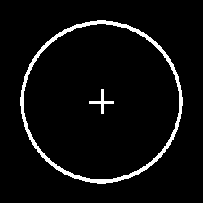
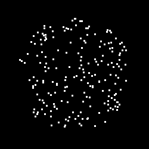
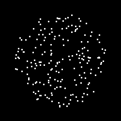
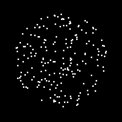
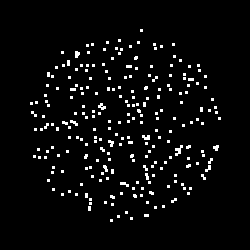
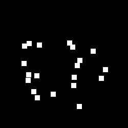
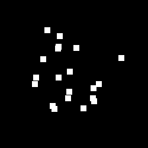

# Random Dot Kinematogram
a random dot kinematogram implemented in pygame
The RDK is fully customisable, i.e. you can change its colour, size, dot coherence, duration of display etc.
Each frame is written to a numpy array and returned by the RDK object, which makes this implementation
suitable for simulations etc.  

### Examples
The easiest way to get started is to call the rdk script and play around with different parameters

#### Trials with Fixation
I've also implemented a fixation cross and aperture, as well as a separate class to define trial sequences.
Below is an example:  

#### Dot coherence
The coherence of random dot motion, i.e. the percentage of dots moving in the
requested direction, can be varied parametrically.  

**1. Example with coherence of 100%**  
  

**2. Example with coherence of 50%**     
  

**3. Example with 0% coherence**  

#### Dot size and density
Both the number of dots and their size can be adjusted.

**1. Example with small and many dots**   

**2. Example with few and large dots**    
  

#### Dot speed
You can also change the speed with which dots move over the screen (in terms of pixels per frame)  

**1. Slow dots**  
  

**2. Fast dots**   
  
